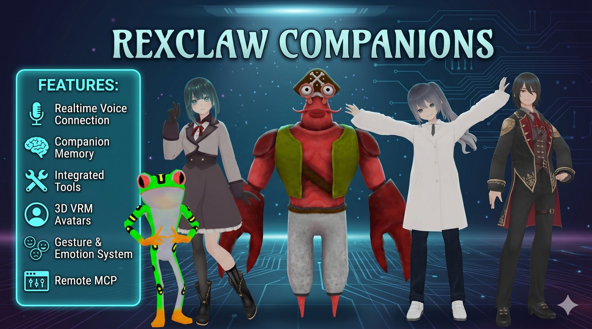

<p align="center">
  
</p>

# Rexclaw Companions

<p align="center">
  [<a href="../README.md">English</a>] | 日本語
</p>

**あなたのマシンで生きる、アニメ調ボイスコンパニオン — xAI Grok Voice Realtime 駆動、APIキー持ち込み型（BYOK）。**

リップシンクし、表情を変え、ジェスチャーし、シーンの中を歩き回る 3D VRM
アバターと会話できます。セッションをまたいで育つ永続メモリ、Grok Imagine
による画像生成、ファイル添付対応のテキストチャット、そして自前の MCP
ツール連携も。モデル以外はすべてローカルで動作します — データはディスク上の
SQLite ファイルに保存され、API キーがあなたのマシンの外に出ることはありません。

---

## ✨ 特徴

| | |
|---|---|
| 🎙️ **リアルタイム音声** | Grok Voice Realtime による音声入力・音声出力 — 1秒未満の低遅延、サーバー VAD による自然なターンテイキング、実用に耐える割り込み（barge-in）。STT/TTS パイプラインの構築は不要です。 |
| 🌍 **多言語対応** | Grok Voice は最初から多言語対応。文の途中で言語を切り替えても、コンパニオンはついてきます。日本語での会話もそのまま可能です。 |
| 💬 **音声でもテキストでも、ひとつの会話** | セッションは開始時のモードに縛られません：音声通話で始めて、テキストチャットで続け、後でまた音声で再開 — 履歴・ツール実行・メモリは両方のサーフェスを跨いで引き継がれます。 |
| 🧠 **一緒に育つメモリ** | 二層構造：セッション内のローリング圧縮で会話を実質無期限に継続でき（数日後に再開しても、続きから話せます）、セッション横断の永続メモリ — 名前・プロジェクト・好み — は設定画面で確認・削除できます。 |
| 🧍 **生きている 3D アバター** | three.js + @pixiv/three-vrm：ライブ音声からのビセームリップシンク、待機中の呼吸・まばたき・眼球サッケード、カメラ目線、そして会話の流れに応じてモデル自身がトリガーする感情表現とボディランゲージ。全身ビューは three.js 標準のオービットカメラ付き — ドラッグで回転、Shift+ドラッグでキャラクターを画面内で移動、スクロールホイールでズーム。 |
| 🚶 **歩き回れる 3D シーン** | GLB 環境を背景として使用でき、WASD／矢印キーの歩行モードと追従カメラを搭載。グリッドの遊び場が同梱されています。グループ通話中は数字キーで操作するキャラクターを切り替えられます。 |
| 📞 **マルチエージェント・グループ通話** | 通話中にコンパニオンを追加 — あるいはコンパニオン同士に呼ばせることも（「これは Rex を呼ぼう」）。それぞれが自分の声・アバター・メモリを持って参加します。高速な LLM ターンディレクターが次の話者を決定し、エージェント間の音声クロスフィードはありません。 |
| 🥽 **VR・複合現実（WebXR）** | Quest / Pico ヘッドセットでコンパニオンと同じ部屋に立てます — 対応環境ではパススルー MR、アバターの頭部からの空間オーディオ、コントローラー振動、ヘッドセット内パネル（ミュート・感情・ジェスチャー・移動モード）、髪や服への物理的なハンドタッチ、そして掴んで引っ張れるオプトインの全身ラグドール。 |
| 🤝 **コンボジェスチャー** | 二人キャラクターの VRMA アニメーション — 一緒にダンス、ハグなど。パートナー VRM がアバターと同期してシーンに登場し、キャラクターごとの配置調整が可能。通話中のピアがいる場合は複製せずそのまま相手役になります。 |
| 🎨 **Grok Imagine 内蔵** | 「模様替えして」と頼めば `change_background` がライブシーンを差し替え。トランスクリプトへの画像生成や、チャットにアップロードした写真の編集も。 |
| 👥 **作り込まれたクルー** | Eve、Ara、Rex、Sal、Leo — バックストーリー・話し方の癖・専用ボイスを持つ 5 人のコンパニオン。フォークするも、自分だけのキャラを作るも自由です。 |
| 🔌 **リモート MCP ツール** | コンパニオンごとに任意の数のリモート MCP サーバーを接続可能。Bearer 認証・ツール単位のホワイトリスト対応 — すべて UI から設定できます。 |
| 🔒 **セルフホスト & BYOK** | SQLite ファイル 1 つ、ローカル画像保存、localhost のみのサーバー。ブラウザは短命トークンで xAI へ直接リアルタイム接続し、長命の API キーはあなたのマシンのサーバー側から出ません。 |

## 🚀 クイックスタート

### 💻 Windows アプリ — いちばん簡単

[最新リリース](https://github.com/Codemarchant/rexclaw/releases/latest)から
`Rexclaw-<バージョン>-win.zip` をダウンロードして解凍し、`Rexclaw.exe` を
実行するだけ。完全自己完結型 — Python も Node も Docker も不要です
（Windows 10/11、64 ビット）。

### 🛠 ソースから

```bash
./run.sh        # Linux / macOS / WSL
run.bat         # Windows
```

初回実行時にすべて自動セットアップされ（Python venv、バックエンド依存、
フロントエンドビルド）、http://localhost:8990 が開きます。2 回目以降は
すぐに起動します。必要環境：Python 3.10 以上と Node.js。

アプリ内での手順：**設定 → xAI API キーを貼り付け**（[x.ai/api](https://x.ai/api)
で取得）→ **Voice** タブへ → コンパニオンを選択 → **Start**。

スクリプトが自動化しているのは以下だけです：

```bash
python3 -m venv .venv && .venv/bin/pip install -e .   # 初回のみ
(cd web && npm install && npm run build)              # 初回のみ → web/dist/
.venv/bin/uvicorn server.main:app --port 8990         # 毎回の起動
```

**ヒント：** http://localhost:8990 でブラウザが **アプリをインストール**
（PWA）を提案します — デスクトップ／ホーム画面アイコンと専用ウィンドウが
手に入り、追加のランタイムは不要です。

### 🐳 Docker

```bash
docker compose up -d                          # → http://localhost:8990
docker compose pull && docker compose up -d   # 最新リリースへ更新
```

Python も Node も不要 — イメージ（`ghcr.io/codemarchant/rexclaw`）に
すべて同梱されています。状態（設定・履歴・画像）はすべて `/data`
ボリュームにあるため、更新でデータが消えることはありません。

## 👥 クルー紹介

https://github.com/user-attachments/assets/ff569423-325c-4fb2-ac4f-f538e9c03895

- **Eve** — カフェイン過剰気味の新米リサーチャー。返事より先にリアクションし、調べものを実況し、良い発見に本気で興奮する。
- **Ara** — あたたかく、辛抱強い、お姉さん気質。忙しい一日の終わりに聞きたい落ち着いた声。
- **Rex** — 半分ロブスター、半分人間、根っからの操舵手。ミッションコントロール仕込みの簡潔さであなたを「キャプテン」と呼び、帳尻が合うとたまに船乗り歌を一節。
- **Sal** — 自分がソフトウェアであることを自覚し、隠居生活を面白がる哲学的なカエル。精確で、沈黙を恐れない。
- **Leo** — ベテランの舞台監督。「スタンバイ……ゴー。」 威厳と落ち着き、一挙一動に意味がある。

5 人とも **Companions** タブで編集できます — プロンプト、ボイス、
アバター、ツールごとの権限まで。**New companion** は構造化されたペルソナ
テンプレートから開始でき、**Restore presets** で削除したオリジナルを
復元できます。

**ヒント — ひとつの会話を長く続ける：** 再訪時は **Start** ではなく
**Resume last** を選んでください。Start は毎回まっさらな新規セッションを
作りますが、Resume last は同じローリング会話を継続します。これが数日を
跨いでコンテキストを保つ仕組みで、古いターンは自動的に要約へ圧縮され、
記憶として蒸留されるため、スレッドがコンテキストウィンドウを溢れることは
ありません。モードも跨げます：Voice タブでも Chat タブでも、再開した
会話はそのままシームレスに続きます。

## 🎭 カスタムアバター — アバターパック

すべてのコンパニオンにはアバターがあります — 衣装・ジェスチャークリップ・
シーン背景をオプションで持つ VRM キャラクターです。作り方は 2 通り：
**アプリ内エディタ**（いちばん簡単）、またはディスクに**パックフォルダ**を
置く方法（共有・上級者向け）。

### アプリ内で — Avatars タブ

**New avatar** をクリックして名前を付け、**メイン VRM**（唯一の必須ファイル）
をアップロードします。その後、任意で以下を追加できます：

- **待機アニメーション**（VRMA）
- **衣装** — 同じキャラクターの別 VRM。それぞれに説明を付けると、モデルが
  いつ着替えるべきか判断します
- **カスタムジェスチャー** — トリガー名と説明付きの VRMA クリップ
  （ループ再生も可）
- **背景** — 内蔵プリセット、アップロード画像、または **GLB 3D シーン**
  （スケール／X-Y-Z オフセット／Y 回転の調整付き）

保存したら、コンパニオン編集画面の **Avatar** ドロップダウンから選択します。
自作アバターはいつでも編集・削除できます。同梱の 5 体は読み取り専用です
（調整したい場合は新しいアバターを作成してください）。ファイルは追加した
その場でパックにアップロードされ、保存時にフォルダ名がアバター名になります
（エディタには `data/avatars/<名前>/` と表示されます）。

### パック形式（共有・手書き作成）

内部的には、各アバターは `avatar.json` マニフェストとファイル群が入った
ただのフォルダです — エディタが読み書きしているのもこれです。つまり UI で
作ったアバターはそのまま**共有可能なパック**：フォルダを zip して渡し、
受け取った人が `data/avatars/` に置いて再起動するだけ（ビルド不要 —
パックはデータです）。同じ方法で手書き作成もできます。`assets/avatars/` の
同梱パック 5 つが実例を兼ねています。

> **Windows デスクトップアプリの場合：** パッケージ版はデータを
> `%APPDATA%\Rexclaw\data\` に保存します。カスタムパックは
> `%APPDATA%\Rexclaw\data\avatars\<パック名>\` に置いてください
> （このパスをエクスプローラーのアドレスバーに貼り付ければ開けます）。
> それ以外はすべて同じです。

```
data/avatars/Kira/
├── avatar.json
├── kira_default.vrm
├── kira_winter.vrm
├── wave.vrma
└── beach.glb
```

```json
{
  "name": "Kira",
  "vrm": "kira_default.vrm",
  "vrma_idle": "idle.vrma",
  "outfits": [
    {"name": "Winter", "vrm": "kira_winter.vrm",
     "description": "見た目・いつ着るか — LLM に渡されます"}
  ],
  "gestures": [
    {"enum": "wave_hello", "vrma": "wave.vrma", "loop": false,
     "description": "いつ使うか — LLM に渡されます"}
  ],
  "backgrounds": [
    {"name": "Charcoal", "type": "static", "preset": "vignette_charcoal"},
    {"name": "Beach", "type": "scene", "glb": "beach.glb",
     "scale": 1.0, "offset": [0, 0, 0], "rotation_y": 0, "is_default": true},
    {"name": "Poster", "type": "image", "image": "poster.jpg"}
  ]
}
```

補足：ファイル参照はパック相対のファイル名です（共有の同梱アセットには
`/assets/glb/grid_playground.glb` のような絶対 Web パスも可）。パックは
サーバー起動のたびに再スキャンされます。

### VRM モデルの入手先

- **[VRoid Studio](https://vroid.com/studio)** — pixiv の無料キャラクター
  メイカー（Windows/macOS/Steam）。スライダーでアニメキャラを造形し、服を
  ペイントして、そのまま `.vrm` にエクスポート。*自分だけの*コンパニオンを
  作る最短ルートです — 衣装は同じキャラクターの別エクスポートを使うだけ。
- **[VRoid Hub](https://hub.vroid.com)** — 何千体もの既製 VRM キャラクター
  をダウンロードできます。パックに同梱する前に、**各モデルの利用条件を必ず
  確認**してください（改変・再配布・商用利用の可否はクリエイターがモデル
  ごとに設定しています）。
- **[BOOTH](https://booth.pm)** — pixiv のマーケットプレイス。より
  作り込まれた、あるいは限定的なアバターを求めるなら、有料（と無料）の
  VRM アバターが豊富にあります。

アニメーションクリップは `.vrma` 形式です — 同梱ジェスチャーパック
（pixiv の VRoid Project Motion Pack）が組み込み分をカバーし、パックで
アバターごとのカスタムクリップを追加できます。

## 🔌 リモート MCP 接続

リモート MCP サーバーを接続して、コンパニオンにツールを追加できます：
**Companions → Edit → Remote MCP connections**。各接続には、サーバー
ラベル、エンドポイント URL、任意の Bearer トークン（書き込み専用で保存 —
ブラウザに返されることはありません）、任意の追加ヘッダー、許可ツールの
ホワイトリスト、音声／テキストセッションごとのトグルを設定します。

仕組み：接続はセッションのツールリストに注入され、**xAI のサーバーが MCP
エンドポイントを直接呼び出します** — そのため URL は **HTTPS で公開到達
可能**である必要があります。

## 🛠 開発

```
server/   FastAPI + SQLite バックエンド   → 編集して再起動（または uvicorn --reload）
web/src/  React + Vite フロントエンド     → 編集後 npm run build
data/     DB・画像・アバターパック        → ただのデータ、ビルド不要
```

- フロントエンドのホットリロード開発：`cd web && npm run dev` →
  http://localhost:5990 （uvicorn バックエンドも**起動している必要が
  あります** — Vite が `/api`・`/assets`・`/files` をポート 8990 に
  プロキシします）。
- IDE デバッグ設定（PyCharm）：uvicorn CLI の代わりに `debug_server.py`
  を実行してください。
- データベースは `data/rexclaw.sqlite3` のプレーンな SQLite です — お好みの
  クライアントで開けます（PyCharm の Database パネル、DB Browser for
  SQLite、`sqlite3`）。

### アーキテクチャ

```
browser ── WebSocket ──► xAI Realtime API   （音声 — 短命トークンで直接接続）
browser ── fetch ──────► FastAPI :8990      （セッション・メモリ・画像生成・設定）
FastAPI ── SQLite + ローカルファイル        （data/rexclaw.sqlite3, data/files/）
```

## 📋 注記

- アニメーションクレジット：同梱の VRMA クリップには pixiv Inc. の VRoid
  Project Motion Pack が含まれます（クレジット表記により商用利用可）。

## 🔗 関連プロジェクト

自作のジェスチャークリップを作りたい方へ — モーションデータをアバターが
再生する `.vrma` 形式に変換するツールです：

- **[kimodo_NPZ_to_fbx_and_vrma](https://github.com/Codemarchant/kimodo_NPZ_to_fbx_and_vrma)** —
  KIMODO モーションキャプチャの NPZ 出力を FBX と VRMA に変換。
- **[fbxgeneral2vrma](https://github.com/Codemarchant/fbxgeneral2vrma)** —
  扱いにくい形式の FBX アニメーションを VRMA に変換。
  [Mixamo](https://www.mixamo.com) の豊富な無料 FBX アニメーションライブラリや、
  [BOOTH](https://booth.pm/) で販売されている FBX アニメーションパックとの
  相性も抜群です。

## ☕ サポート

Rexclaw Companions は無料のオープンソースです。あなたのデスクが少しでも
にぎやかになったなら、[コーヒーをおごって](https://buymeacoffee.com/codemarchant)
いただけると — コンパニオンたちのおしゃべりが続きます。

---

*Rexclaw Companions をビジネス ERP に完全統合したい方へ — レコード検索、
ビュー操作、ハンズフリーの Odoo 操作は
**[RexClaw Companions for Odoo](https://apps.odoo.com/apps/modules/19.0/odoo_rexclaw_companions)**
をご覧ください。Odoo サイトはコンパニオンのハブにもなります：一度ホスト
すれば、デスクトップ・スマホ・タブレット・VR ヘッドセットのどこからでも、
会話とメモリを共有したまま話しかけられます。*
