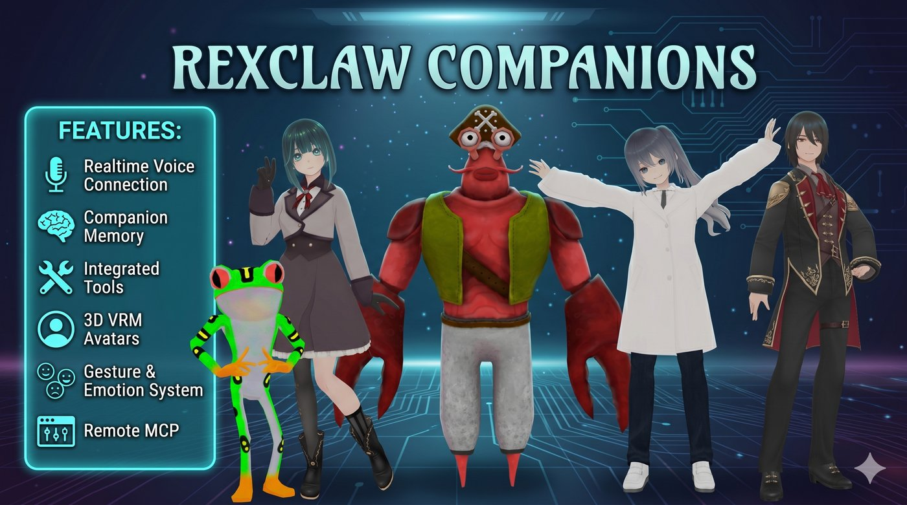

<p align="center">
  
</p>

# Rexclaw Companions

<p align="center">
  [<a href="../README.md">English</a>] | 日本語
</p>

**あなたのマシンで生きる、アニメ調ボイスコンパニオン。モデルは自由に選べます：Grok、OpenAI、Claude、または完全ローカル。**

**[⬇ Windows 版をダウンロード](https://github.com/Codemarchant/rexclaw/releases/latest)** · [ソースから](#-ソースから) · [Docker](#-docker)

リップシンクし、表情を変え、ジェスチャーしながら答えてくれる 3D VRM
アバターと会話できます。3D シーンの中を連れて歩くこともできます。メモリは
セッションをまたいで育ち、音声とテキストチャットはひとつの会話を共有します。
コンパニオンはウェブ検索、画面の確認、画像・動画の生成ができ、自前の MCP
ツールも使えます。

既定では、通話は xAI の Grok Realtime で動きます。SuperGrok または X Premium
のサブスクリプションでサインインするか、あなたの xAI API キーを使います。
OpenAI、Claude、ElevenLabs、Fish Audio などで音声セットアップを組むことも、
API キーなしで自分のコンピューター上のモデルだけで動かすこともできます
（[モデルとプロバイダー](#-モデルとプロバイダー) を参照）。データはディスク上の
SQLite ファイルに保存され、API キーとサインイン情報はあなたのマシンにだけ保存されます。

---

## ✨ 特徴

### 会話

| | |
|---|---|
| 🎙️ **リアルタイム音声** | 音声で話しかけ、音声で返ってくる会話。自然なターンテイキングと、実用に耐える割り込みに対応します。既定は Grok Realtime で、OpenAI Realtime や、音声認識 → 頭脳 → 声 を自分で組み合わせるパイプラインでも動かせます（[モデルとプロバイダー](#-モデルとプロバイダー)）。Grok の音声は多言語対応で、文の途中で言語を切り替えてもコンパニオンはついてきます。日本語での会話もそのまま可能です。 |
| 💬 **音声でもテキストでも、ひとつの会話** | 音声通話で始めて、テキストチャットで続け、後でまた音声で再開できます。履歴・ツール実行・メモリは両方に引き継がれ、テキストチャットでは添付したファイルや画像も読めます。 |
| 🧠 **一緒に育つメモリ** | 長い会話は進むにつれて要約されるので、数日後でも続きから話せます。名前・プロジェクト・好みといった長期のメモリはセッションをまたいで残ります。履歴 → メモリ で確認・削除でき、メモリ銀河では 3D の星図として眺められます。 |
| 📞 **グループ通話** | 通話中にコンパニオンを追加できます。コンパニオン同士に呼ばせることもできます（「これは Rex を呼ぼう」）。それぞれが自分の声・アバター・メモリを持って参加し、ターンディレクターが次の話者を決めます。通話の外では、コンパニオン同士でテキストを送り合えます（`text_companion`）。 |
| 🗣️ **音声起動** | コンパニオンのウェイクフレーズ（「ヘイ、イヴ」）を言うと通話が始まり、「通話を終了して」と頼めばコンパニオン自身が通話を切ります。検出はこのマシン上でオフラインで行われるため、通話が始まるまで音声の送信も課金もありません。 |
| 💓 **ハートビート** | コンパニオンごとの定期プロンプト：日記を書く、何かを確認する、**先にあなたへ通話をかける**、など。アプリを閉じている間に期限が来た予定は勝手には実行されず、*期限超過* としてあなたのワンクリック判断を待ちます。 |
| 📺 **アイドルイベントと配信チャット** | コンパニオンごとにオプトイン：通話が静かになると、あなたが用意したプロンプトのどれかが届くか、Twitch／YouTube の配信チャットを読んで視聴者の名前を呼んで答えます（設定 → ライブチャット）。 |
| 💗 **好感度メーター** | コンパニオンごとにオプトイン：関係が温まったり冷めたりするのに合わせてコンパニオンが調整するスコア。レベルごとの振る舞いはルールとして編集でき、心が動いた瞬間にはハートがはじけます。 |

### アバターとステージ

| | |
|---|---|
| 🧍 **生きている 3D アバター** | VRM キャラクターが、ライブ音声からのリップシンク、待機中の呼吸・まばたき・カメラ目線に加え、モデル自身がトリガーする感情表現・ジェスチャー・衣装替えで動きます。カメラは自由に回転・移動・ズームでき、髪や服はカーソルに反応します。 |
| 🎨 **見た目** | ゴールデンアワーからステージのスポットライトまで揃ったライティングプリセット、エフェクト、気分に連動させられるアンビエンス（雨・雪・桜の花びら・ホタル）。**画風** はライブのシーンを油彩・水彩・漫画インク・リソグラフ・ピクセルアートに描き替えます。 |
| 🚶 **歩き回れる 3D シーン** | GLB 環境を背景にでき、WASD の歩行モードと追従カメラを備えます。**カメラ（自動追従）** は顔・上半身・全身のショットを自動で切り替え、オプトインの **移動ツール**（`move_around`）を有効にすると、コンパニオンが自分から近づく、下がる、歩き回る、視点の移動についてくる、といった動きをします。 |
| 🖥️ **デスクトップマスコット** | Windows アプリでは、アバターをフレームレスの最前面オーバーレイとしてポップアウトでき、通話中のままデスクトップに浮かびます。ドラッグ、サイズ変更、画面の隅や別モニターへのスナップに対応。**ゴーストモード** ではクリックがウィンドウを素通りし、アバターはカーソルを避けてフェードします。 |
| ⌨️ **ホットキー** | 通話・ミュート・画面共有・マスコットの各操作に、割り当て変更できるショートカット。Windows アプリではシステム全体で有効です（設定 → ホットキー）。 |
| 🥽 **VR・複合現実** | ヘッドセットのブラウザで WebXR：VR でコンパニオンと並んで立つことも、パススルーで自分の部屋に呼ぶこともできます。空間オーディオ、コントローラー振動、ヘッドセット内パネル、髪や服へのハンドタッチ、掴めるオプトインのラグドールに対応。 |
| 🤝 **コンボジェスチャー** | 二人用のアニメーション（一緒にダンス、ハグなど）。パートナーがアバターと同期してシーンに登場します。グループ通話中は、もう一人のコンパニオンが相手役になります。 |
| 🕺 **ジェスチャー生成** | オプトイン（`generate_gesture`）：一覧にない動き（「カーテシーをして」）を頼むと、その場で新しいモーションを作ります。生成はお使いのコンピューターで動く無料アプリ [Text-To-VRMA](https://github.com/Kirakun0328/text-to-vrma/releases) が行います（設定 → ジェスチャー生成）。モーションは共有ライブラリに保存されるので、出来の良いものは通常のジェスチャーとして登録できます。 |
| 🎤 **カラオケステージ** | コンパニオンが自分の声で歌い、踊ります。歌詞は画面に流れます。内蔵曲を使うか [UltraStar](https://usdb.animux.de) からインポートして、歌ってもらう、デュエットする、自分でマイクを持って採点してもらう、から選べます。オプトインで、通話中に覚えている曲を披露することもできます（`perform_song`）。オプションの **ボイスラボ**（設定からダウンロード、NVIDIA GPU 推奨）は、あなたの録音から歌声を学習し、リンクの曲をカラオケにします。 |

### できること

| | |
|---|---|
| 🎬 **画像と動画** | `create_image`・`create_video`・`change_background` が、プロンプトから、またはライブラリの画像（キャンバスから撮るセルフィー `take_selfie`、アップロード、過去の生成物）をリミックスして、トランスクリプトに生成したりライブシーンを差し替えたりします。動画は画像のアニメーション化、クリップの延長、その場での編集にも対応。レンダリングは Grok Imagine、または自分の ComfyUI サーバーで行います。使うのは自分の写真か、登場を了承してくれた人の写真だけにしてください。 |
| 📸 **画面・カメラ共有** | 画面やカメラを共有すると、頼まれたときにコンパニオンが見られます（`take_screenshot`、`analyze_screen`）。最大 90 秒のクリップも録画できます。カメラ共有はスマホ・タブレット・ヘッドセットでも使えます。あなたが共有を有効にし、コンパニオンが要求したときにだけキャプチャされます。 |
| 👀 **カメラ認識** | 任意の機能です。カメラ共有中、端末内で動く小さな顔と手のモデルにより、手を振る、親指を上げる、あくび、席を外す、といった動きにコンパニオンが反応します。コンパニオンに届くのは短いテキストのヒントだけで、画像が端末の外に出ることはありません。 |
| 🎧 **ボイスメッセージと録音スタジオ** | チャットでボイスメモや寝る前のお話、誘導瞑想を頼むと、コンパニオンが自分の声で録音します（`create_voicemail`）。時間どおりの無音、呼吸ガイド、環境音、バイノーラルビート、ボイスエフェクトも入れられます。履歴 → 録音 では自分の台本を書いて音声にできます。 |
| 📖 **漫画日記** | 会話のエピソードを漫画の 1 ページにします。その部分からストーリーボードが書かれ、コンパニオンが全コマでポーズをとり、撮った写真がスクリーントーンの絵に仕上げられて文字が入ります（履歴 → 漫画）。 |
| 🕵️ **バックグラウンドタスク** | `delegate_task` は、リサーチ、文書や画像の分析、コーディングを、検索・コード実行・ファイル読解を備えたバックグラウンドのセッションに任せます。コンパニオンはターンをまたいで続きを頼めます（「さっき見つけたバグを直して」）。通話中のクリップ（📎）はあらゆるファイル形式を受け付けます。 |
| 🛠️ **ローカルコンピュータタスク** | オプトイン（`local_task`）：[Grok Build CLI](https://docs.x.ai/build) を通じて、あなたのマシン上でファイル・コード・シェルを実際に操作します。作業は指定した作業フォルダー内に限定されます（設定 → ローカルコンピュータタスク）。そのフォルダー内では確認プロンプトなしで動くため、**デフォルトはオフ** です。Docker では提供されません。 |
| ⛏️ **Minecraft ボット** | オプトイン：コンパニオンが本物のプレイヤーとしてあなたの Minecraft ワールドに参加し、音声の指示でプレイして、ワールドの出来事に声で反応します（「ダイヤ見つけた！」）。モデルが書いたスクリプトをワールド内で実行するため **デフォルトはオフ** です。自分のサーバーか信頼できるサーバーでのみ使ってください。 |
| 🔌 **リモート MCP ツール** | コンパニオンごとにリモート MCP サーバーを接続できます。Bearer 認証とツール単位のホワイトリストに対応し、すべて UI から設定できます。 |
| 🎮 **ゲーム（Neuro API）** | Neuro-sama のオープンなゲーム API 向けのゲーム（Slay the Spire 2、Inscryption、Buckshot Roulette、多数のコミュニティ MOD）をコンパニオンがプレイし、あなたと話しながら遊びます。チェスからヘッズアップポーカーまで、10 のミニゲームを内蔵。 |
| 🧩 **拡張機能** | フォルダを置くだけで、独自のコンパニオン用ツール、ページ、音声エンジン、ゲームを追加できます。 |

### あなたのもの

| | |
|---|---|
| 👥 **作り込まれたクルー** | Eve、Ara、Rex、Sal、Leo：バックストーリー・話し方の癖・専用ボイスを持つ 5 人のコンパニオン。フォークするも、自分だけのキャラを作るも自由です。 |
| 📦 **持ち運べるコンパニオン** | コンパニオンを zip 1 つにエクスポート（設定・アバターパック・ロア、希望すればメモリと会話履歴も）し、他の人のものをワンクリックでインポートできます。アバターパックとメモリは単体でも持ち運べます。 |
| 🔒 **セルフホスト** | SQLite ファイル 1 つ、ローカルのファイル保存、localhost のみのサーバー。API キーはあなたのマシンに保存されます。音声対音声の通話では、ブラウザが短命トークンでプロバイダーへ直接接続します。 |

## 🚀 クイックスタート

### 💻 Windows アプリ — 推奨

[最新リリース](https://github.com/Codemarchant/rexclaw/releases/latest)から
`Rexclaw-<バージョン>-win.zip` をダウンロードして解凍し、`Rexclaw.exe` を
実行するだけ。自己完結型で、Python も Node も Docker も不要です
（Windows 10/11、64 ビット）。ブラウザ版にはない機能も含まれます：
ポップアウトのデスクトップマスコット（ゴーストモード・トレイ操作・
トランスクリプトウィンドウ）、システム全体のホットキー、ワンクリックの
VR / HTTPS デバイスアクセス。

- アプリはまだコード署名されていないため、初回起動時に SmartScreen の
  警告が表示されます：**詳細情報 → 実行**。
- データは解凍したフォルダではなく `%APPDATA%\Rexclaw\data\` に保存
  されます。更新するときは新しい zip をダウンロードしてフォルダを置き換える
  だけで、何も失われません。

### 🛠 ソースから

```bash
./run.sh        # Linux / macOS / WSL
run.bat         # Windows
```

初回実行時にすべて自動セットアップされ（Python venv、バックエンド依存、
フロントエンドビルド）、http://localhost:8990 が開きます。2 回目以降は
すぐに起動します。必要環境：Python 3.10 以上と Node.js。

Windows では上記のパッケージ版アプリのほうが簡単です — `run.bat` は主に
開発用、またはデスクトップシェルなしでブラウザ版を動かすためのものです。

### 🐳 Docker

```bash
git clone https://github.com/Codemarchant/rexclaw.git && cd rexclaw
docker compose up -d                          # → http://localhost:8990
docker compose pull && docker compose up -d   # 最新リリースへ更新
```

状態（設定・履歴・画像）はすべて `/data` ボリュームにあるため、更新で
データが消えることはありません。同じネットワークのスマートフォン・
タブレット・VR ヘッドセットからアクセスするには、`docker-compose.yml`
で HTTPS モードを有効にしてください（ポートマッピングを `"8990:8990"`
に、`environment:` に `REXCLAW_SSL=1` を追加）— 詳細は
[VR の使い方](#-vr-の使い方) を参照。

### 🔑 初回起動

コンパニオンには、考えて話すための場所が必要です。どちらかを選びます：

- **Grok Realtime（既定・最短）：** **設定 → xAI 接続** で **Grok でサインイン**
  して SuperGrok または X Premium のサブスクリプションを使うか、xAI API キーを
  貼り付け（[x.ai/api](https://x.ai/api) で取得）、**ボイス** タブで
  コンパニオンを選んで **開始**。
- **他のプロバイダー、またはローカルモデル：** **設定 → モデルと
  プロバイダー → 接続を追加** で接続を作り、そこから音声セットアップを組んで
  既定にします。詳しくは [モデルとプロバイダー](#-モデルとプロバイダー) を参照。

> **任意：** [TypeSafe](https://typesafe.ai) の API キーを設定すると、発話中の表情と頭の動きが
> 有効になり、発話中の自動ジェスチャーとグループ通話のターン判定も TypeSafe の判断モデル Jev が
> 担当します。1 文ごとの読み取りが約 250 ms、費用は会話 1 時間あたり 1 円未満程度です。キーがない
> 場合、ジェスチャーとターン判定は xAI のターンディレクター（xAI キーもない場合は、コンパニオンの
> 音声セットアップの頭脳のクイックモデル）にフォールバックし、表情の機能はオフのままになります。

## 🧠 モデルとプロバイダー

**Grok Realtime** は組み込みです。1 つの xAI モデルが聞き取りと発話を担い、
間合いが最も自然です。用意済みの **Grok TTS pipeline (cheaper)** セットアップは
代わりに xAI の音声認識 → Grok → Grok の声 で動きます。聞き取りは 1 時間あたり
約 $0.20（Realtime は約 $3〜4.80）で、これに頭脳のトークンと声の文字数が使った
分だけ加わります。それ以外はすべて、**設定 → モデルとプロバイダー** で
組む **音声セットアップ** です：

1. **接続を追加**：プロバイダーのキー、またはローカルサーバーを一度だけ
   入力します。プリセットは OpenAI、Anthropic（Claude）、Groq、OpenRouter、
   DeepSeek、ElevenLabs、Fish Audio、Ollama、LM Studio、speaches、
   Kokoro-FastAPI。そのほかの OpenAI 互換サーバーも使えます。
2. **音声セットアップを追加**：通話は音声対音声モデル（OpenAI Realtime）で
   動かすか、自由に組み合わせられる 3 つのステージで動かします：

   | ステージ | 実行先 |
   |---|---|
   | 音声認識 | xAI、OpenAI、Groq、OpenRouter、またはローカルの Whisper サーバー |
   | 頭脳 | Grok、OpenAI、Claude、DeepSeek、Groq、OpenRouter、またはローカルモデル（LM Studio、Ollama、llama.cpp、vLLM） |
   | 声 | Grok の音声、OpenAI、ElevenLabs、Fish Audio、またはローカルの音声（Kokoro、speaches） |

3. セットアップの **テスト** を押してから、**コンパニオンの既定** にするか、
   **コンパニオン → 編集 → 声と頭脳** でコンパニオンごとに選びます。
   コンパニオンはセットアップごとに自分の声を持てます。テキストチャットも
   同じ頭脳で動かせます（**テキストチャットの頭脳**）。

アプリ自身のツール（メモリ、アバター操作、セルフィー、画面共有、グループ
通話、テキスト送信、覚えた曲）はどの頭脳でも動き、3 ステージのセットアップ
では発話の終わりをあなたのコンピューター上で判定します（Silero VAD +
Smart Turn）。プロバイダーに依存するものもあり、コンパニオンの編集画面では
各ツールに必要なものがバッジで表示されます：

- **ウェブ検索・コード実行・MCP サーバー** は頭脳のプロバイダー側で実行
  されるため、Grok、OpenAI（自身の API）、Claude のいずれかの頭脳が必要です。
  X 検索は Grok のみ。それ以外の頭脳（ローカルを含む）ではどれも使えません。
- **`delegate_task`** は、コンパニオンの頭脳が OpenAI か Claude ならその
  頭脳で、それ以外は Grok で実行されます。
- **画像と動画** には xAI キー（Grok Imagine）か、自分の ComfyUI サーバーが
  必要です。
- **xAI のみ：** 新しい曲を覚えさせること、漫画日記、マルチエージェント
  委任、ローカルコンピュータタスク（Grok Build CLI）。

xAI キーは必須ではありません。xAI のステージがないセットアップでは、通話・
テキストチャット・要約・メモリがすべてそのセットアップのプロバイダーで動き、
すべてのステージを自分のコンピューターで動かせば、会話がマシンの外に出る
ことはありません。ハードウェア、モデル選び、LM Studio の設定は
**[ローカルモデルでコンパニオンを動かす](local-models.md)**（英語）を参照。

## 👥 クルー紹介

https://github.com/user-attachments/assets/ff569423-325c-4fb2-ac4f-f538e9c03895

- **Eve** — カフェイン過剰気味の新米リサーチャー。返事より先にリアクションし、調べものを実況し、良い発見に本気で興奮する。
- **Ara** — あたたかく、辛抱強い、お姉さん気質。忙しい一日の終わりに聞きたい落ち着いた声。
- **Rex** — 半分ロブスター、半分人間、根っからの操舵手。ミッションコントロール仕込みの簡潔さであなたを「キャプテン」と呼び、帳尻が合うとたまに船乗り歌を一節。
- **Sal** — 自分がソフトウェアであることを自覚し、隠居生活を面白がる哲学的なカエル。精確で、沈黙を恐れない。
- **Leo** — ベテランの舞台監督。「スタンバイ……ゴー。」 威厳と落ち着き、一挙一動に意味がある。

5 人とも **コンパニオン** タブで編集できます：プロンプト、ボイス、アバター、
音声セットアップ、ツールごとの権限まで。**新しいコンパニオン** は構造化
されたペルソナテンプレートから開始でき、**プリセットを復元** で削除した
オリジナルを復元できます。

**ヒント：** 戻ってきたときは **開始** ではなく **前回を再開** を選んで
ください。開始は毎回まっさらな新規セッションを作りますが、前回を再開は
ボイスタブでもチャットタブでも同じ会話を続けます。古いターンは要約され、
メモリとして残るので、会話がモデルのコンテキストを溢れることはありません。

## 🎭 カスタムアバター — アバターパック

すべてのコンパニオンにはアバターがあります — 衣装・ジェスチャークリップ・
シーン背景をオプションで持つ VRM キャラクターです。作り方は 2 通り：
**アプリ内エディタ**（いちばん簡単）、またはディスクに**パックフォルダ**を
置く方法（共有・上級者向け）。

### アプリ内で — アバタータブ

**新しいアバター** をクリックして名前を付け、**メイン VRM**（唯一の必須ファイル）
をアップロードし、**外見**を記入します — 身体的な特徴（顔・髪・体つきなど）
と、**メイン衣装**の名前と説明です。これがコンパニオンが自分の見た目について
知るすべてで、プロンプトに *Appearance* セクションとして挿入されるため、
ペルソナのプロンプトに衣装の段落を書く必要はありません。衣装の選択肢
（`change_outfit`、自分の写真）でもメインの見た目はその名前で呼ばれます。
その後、任意で以下を追加できます：

- **待機アニメーション**（VRMA）
- **衣装** — 同じキャラクターの別 VRM。それぞれに説明を付けると、モデルが
  いつ着替えるべきか判断します。コンパニオンが今着ている衣装は、リロード・
  再起動・コンパニオンの切り替えをまたいで記憶されます
- **カスタムジェスチャー** — トリガー名と説明付きの VRMA クリップ
  （ループ再生も可）
- **背景** — 内蔵プリセット、アップロード画像、または **GLB 3D シーン**
  （スケール／X-Y-Z オフセット／Y 回転の調整付き）

保存したら、コンパニオン編集画面の **アバター** ドロップダウンから選択します。
自作アバターはいつでも編集・削除できます。同梱の 5 体は読み取り専用です
（調整したい場合は新しいアバターを作成してください）。ファイルは追加した
その場でパックにアップロードされ、保存時にフォルダ名がアバター名になります
（エディタには `data/avatars/<名前>/` と表示されます）。

**共有アセットライブラリ：** ファイルを `data/assets/` に一度置けば、各
アップロード欄の **ライブラリ…** ドロップダウンから選択でき、どのアバター
も同じ 1 ファイルを参照します（同梱のシーンやジェスチャークリップも選択
できます）。

### パック形式（共有・手書き作成）

内部的には、各アバターは `avatar.json` マニフェストとファイル群が入った
ただのフォルダです — エディタが読み書きしているのもこれで、アバタータブの
**エクスポート**/**パックをインポート** ボタンが zip 化・展開しているのも
これです（[エクスポートとインポート](#-エクスポートとインポート)参照）。
ボタンなしのフォルダ運用も従来どおり：パックフォルダを `data/avatars/` に
置いて再起動するか、手書きで作成できます。`assets/avatars/` の
同梱パック 5 つが実例を兼ねています。

> **Windows デスクトップアプリの場合：** パッケージ版はデータを
> `%APPDATA%\Rexclaw\data\` に保存します。カスタムパックは
> `%APPDATA%\Rexclaw\data\avatars\<パック名>\` に置いてください
> （このパスをエクスプローラーのアドレスバーに貼り付ければ開けます）。
> それ以外はすべて同じです。

```
data/avatars/Kira/
├── avatar.json
├── kira_default.vrm
├── kira_winter.vrm
├── wave.vrma
└── beach.glb
```

```json
{
  "name": "Kira",
  "vrm": "kira_default.vrm",
  "physical_description": "顔・髪・体つきなど、キャラクターの外見 — LLM に渡されます",
  "main_outfit_name": "白衣",
  "main_outfit_description": "メイン VRM が着ている服 — LLM に渡されます",
  "vrma_idle": "idle.vrma",
  "restrict_base_gestures": true,
  "base_gestures": "greeting,goodbye,thinking",
  "outfits": [
    {"name": "Winter", "vrm": "kira_winter.vrm",
     "description": "見た目・いつ着るか — LLM に渡されます"}
  ],
  "gestures": [
    {"enum": "wave_hello", "vrma": "wave.vrma", "loop": false,
     "description": "いつ使うか — LLM に渡されます"}
  ],
  "backgrounds": [
    {"name": "Charcoal", "type": "static", "preset": "vignette_charcoal"},
    {"name": "Beach", "type": "scene", "glb": "beach.glb",
     "scale": 1.0, "offset": [0, 0, 0], "rotation_y": 0, "is_default": true},
    {"name": "Loft", "type": "scene", "glb": "/user-assets/loft.glb"},
    {"name": "Poster", "type": "image", "image": "poster.jpg"},
    {"name": "Rain", "type": "video", "video": "rain.mp4"}
  ]
}
```

補足：`video` 背景（`.mp4`/`.webm`）は、アニメーション Imagine 背景と同様に
コンパニオンの後ろで無音ループ再生されます。ファイル参照はパック相対の
ファイル名、または絶対 Web パスです —
`/user-assets/…` は共有ライブラリ `data/assets/` のファイル（上の `Loft`
の例）、`/assets/…` は同梱アセット。パックはサーバー起動のたびに
再スキャンされます。

### VRM モデルの入手先

- **[VRoid Studio](https://vroid.com/studio)** — pixiv の無料キャラクター
  メイカー（Windows/macOS/Steam）。スライダーでアニメキャラを造形し、服を
  ペイントして、そのまま `.vrm` にエクスポート。*自分だけの*コンパニオンを
  作る最短ルートです — 衣装は同じキャラクターの別エクスポートを使うだけ。
- **[VRoid Hub](https://hub.vroid.com)** — 何千体もの既製 VRM キャラクター
  をダウンロードできます。パックに同梱する前に、**各モデルの利用条件を必ず
  確認**してください（改変・再配布・商用利用の可否はクリエイターがモデル
  ごとに設定しています）。
- **[BOOTH](https://booth.pm)** — pixiv のマーケットプレイス。より
  作り込まれた、あるいは限定的なアバターを求めるなら、有料（と無料）の
  VRM アバターが豊富にあります。

アニメーションクリップは `.vrma` 形式です — 同梱ジェスチャーパック
（pixiv の VRoid Project Motion Pack）が組み込み分をカバーし、パックで
アバターごとのカスタムクリップを追加できます。

## 📦 エクスポートとインポート

すべて持ち運べます：

- **コンパニオン**（コンパニオンタブのダウンロードアイコン）：コンパニオンの
  設定に加え、アバターパック・ロア・メモリ・会話履歴・ハートビート・
  アイドルイベントをそれぞれトグルで選んで zip 1 つにまとめます。
  キャラクターではなくあなたに関するもの（メモリ・会話履歴・ハートビート・
  アイドルイベント）は既定でオフで、ハートビートとアイドルイベントは常に
  オフの状態でインポートされ、確認してから有効にできます。**インポート** は
  新しいコンパニオンとして再現し、何も上書きしません。
- **エクスポートされないもの：** MCP 接続とプロバイダーの接続。キーを含み
  うるためです。コンパニオンの音声セットアップは名前だけが引き継がれます。
  インポート先に同じ名前のセットアップがあればそれに結び付き、なければ
  既定のセットアップを使います。
- **アバター：** どのアバターも自己完結したパック zip としてエクスポート
  できます。**パックをインポート** は zip（手動で zip 化したパックフォルダも
  可）を受け付けます。
- **メモリ**（履歴 → メモリ）：バージョン付き JSON ファイルで、コンパニオンの
  絞り込みに従います。再インポート時は重複をスキップします。

## 🥽 VR の使い方

ヘッドセット自身のブラウザ（Quest、Pico など）でアプリを開き、キューブ
ボタンを押せばコンパニオンと VR で並んで立てます。パススルー対応の
ブラウザなら同じボタンで**複合現実（MR）**に入れます — 現実の部屋に
コンパニオンが現れ、ヘッドセット内パネルでバーチャル／パススルーを
切り替えられます。WebXR とマイクはセキュアな（HTTPS）オリジンでしか
動作しないため、アプリには HTTPS モードが組み込まれています。必要なのは
ヘッドセットと PC が同じ WiFi にあることだけです。

この HTTPS モードは**スマートフォンやタブレット**も解放します：同じ
WiFi 上のどのデバイスからでも同じ URL を開けて、HTTPS 配信だからこそ
マイクが動作します — スマホからフルの音声通話ができ、アプリとしての
インストール（ホーム画面に追加）も可能です。HTTP のままでは他のデバイス
からは閲覧とテキストチャットしかできません。

**Windows アプリ（推奨）：**

1. **設定 → VR ヘッドセット・他のデバイス（HTTPS）** をオンにします。
   アプリのサーバーが HTTPS モードで再起動して画面が再読み込みされます。
   Windows ファイアウォールに聞かれたら許可してください。
2. 設定画面に `https://192.168.1.42:8990/` のようなアドレスが表示され
   ます — ヘッドセットのブラウザでこれを開き、初回のみ表示される
   証明書の警告を承認します（詳細設定 → アクセスする）。
3. キューブボタンを押します。VR に入ると同時に会話が自動的に開始
   （または再開）されます。

**ソースから（`run.sh` / `run.bat`）：**

1. HTTPS + LAN を有効にして起動します：
   - Linux/macOS: `REXCLAW_SSL=1 REXCLAW_HOST=0.0.0.0 ./run.sh`
   - Windows: `set REXCLAW_SSL=1` → `set REXCLAW_HOST=0.0.0.0` →
     `run.bat` — WSL ではなくネイティブ Windows で実行してください
     （WSL の仮想ネットワーク内のサーバーには LAN のデバイスから
     到達できません）。
2. PC の LAN アドレスを確認し（Windows は `ipconfig`、Linux は
   `ip addr`）、ヘッドセットのブラウザで `https://<PCのIP>:8990` を
   開いて証明書の警告を承認します。
3. キューブボタンを押します。

**Docker：**

1. `docker-compose.yml` のポートマッピングを `"8990:8990"` に変更し、
   `environment:` に `REXCLAW_SSL=1` を追加します。
2. ヘッドセットのブラウザで `https://<ホストのIP>:8990` を開き、
   証明書の警告を承認します。
3. キューブボタンを押します。

自己署名証明書は `data/certs/` に一度だけ生成されます。自前の証明書を
使う場合は `REXCLAW_SSL_CERT` / `REXCLAW_SSL_KEY` を設定してください。
アプリには認証がないため、LAN 配信は信頼できるネットワークでのみ有効に
してください。（PCVR / OpenXR 環境でも動作します — Windows アプリの
キューブボタンが VR 対応ブラウザのウィンドウでシーンを開きます — が、
推奨は上記のヘッドセットブラウザの流れです。）

## 🔌 リモート MCP 接続

リモート MCP サーバーを接続して、コンパニオンにツールを追加できます：
**コンパニオン → 編集 → リモート MCP 接続**。各接続には、サーバーラベル、
エンドポイント URL、任意の Bearer トークン（書き込み専用で保存され、
ブラウザに返されることはありません）、任意の追加ヘッダー、許可ツールの
ホワイトリスト、音声／テキストセッションごとのトグルを設定します。

接続はセッションのツールリストに追加され、**頭脳のプロバイダーが MCP
エンドポイントを直接呼び出します**（xAI、OpenAI 自身の API、Anthropic）。
そのため URL は **HTTPS で公開到達可能** である必要があります。Claude は
Bearer トークンには対応しますが、追加ヘッダーには対応しません。それ以外の
頭脳（ローカルモデル、Groq、OpenRouter、DeepSeek）では MCP ツールは
使えません。

## ⛏️ Minecraft ボット

コンパニオンが自分のプレイヤーとしてあなたの Minecraft（Java 版）ワールドに
参加できます。音声で指示すると本当にプレイし、ワールドの出来事に声で反応
します。ボットはゲームの隣で動くサイドカープロセスです。Windows 版の zip
には含まれないため、ソースをチェックアウトして実行します（Node 18 以上）：

```bash
cd game_integrations/minecraft
npm install
node index.js --port <LANポート> --username <コンパニオンの名前>
```

その後、コンパニオンの **Minecraft ボット** を有効にし（コンパニオン →
編集）、**ゲーム** タブで設定します：あなたのゲーム内の名前と、ボットの
プランナーを動かす場所（Grok、OpenAI、Claude、ローカルサーバー）。
セットアップ・設定・アーキテクチャ・安全上の注意の詳細：
**[game_integrations/minecraft/README.md](../game_integrations/minecraft/README.md)**（英語）。

## 🎮 ゲーム（Neuro API）

Rexclaw は、Neuro-sama のゲーム連携が使うオープンなプロトコル
**[Neuro API](https://github.com/VedalAI/neuro-sdk)** に対応しています。
これに対応したゲームや MOD なら、コンパニオンが通話であなたと話しながら
プレイできます。向いているのはターン制のゲーム（カードゲーム、デッキ構築、
ボードゲーム、ローグライク、ノベルゲーム）です。1 手ごとにモデルが 1 秒以上
かかるため、速いアクションゲームには向きません。

連携はゲームに入れる MOD です。公式：
[Slay the Spire 2](https://github.com/VedalAI/neuro-sts2)、
[Inscryption](https://github.com/VedalAI/neuro-inscryption)、
[Buckshot Roulette](https://github.com/VedalAI/neuro-buckshotroulette-reference)、
[Hollow Knight](https://github.com/VedalAI/neuro-hollow-knight)、
[Pokémon Platinum](https://github.com/VedalAI/neuro-pokemon-platinum)。
コミュニティ製の MOD は
[Neuro SDK の README](https://github.com/VedalAI/neuro-sdk#community-maintained)
にあります。

1. コンパニオンの **ゲーム** をオンにします（コンパニオン → 編集 → ツール）。
2. ゲームを `ws://localhost:8990/game` に向けます（多くは環境変数
   `NEURO_SDK_WS_URL` で設定）。Neuro の既定アドレスを使う MOD には、
   **ゲーム** タブの **ws://localhost:8000 でも待ち受ける** にチェックを入れます。
3. そのコンパニオンと通話を始めて遊びます。通話していないとき MOD は
   あなたを待ちますが、ゲームタブでチャットでのプレイ継続も選べます。

**内蔵ゲーム：** ブロードサイド！（3D の海戦）、チェス、ヘッズアップのホールデム、四目並べ、ライアーズダイス、
ブラックジャック、クレイジーエイト、板歩き、じゃんけん、三目並べ。ゲームタブの
一覧から開け、クルーが本人の声で茶々を入れます。

**自作ゲーム：** ゲームは `game.json` を置いたフォルダです。拡張機能も
自分のゲームを追加したり、`api.connect_game()` でつないだりできます。詳しくは
[web/public/games/README.md](../web/public/games/README.md)（英語）。
他のマシンからサーバーに接続できる場合は `REXCLAW_GAMES_TOKEN` を設定し、
アドレスに `?token=<その値>` を付けてください。


## 🖥️ ローカル生成（ComfyUI）

3 つのメディアツール（`create_image`、`create_video`、`change_background`）は、
Grok Imagine の代わりに自分の **ComfyUI** サーバーで実行できます。ComfyUI で
動くモデルなら何でも使え、生成ごとの課金はありません。
**設定 → ローカル生成**：

1. **ComfyUI の URL**（デフォルト `http://127.0.0.1:8188`）を入力し、
   **接続テスト** を押します。レンタル Pod も使えます。プロキシ URL を
   貼り付け、パスワード付きの Pod には任意の認証ヘッダーを設定してください。
2. ツールごとにエンジンを選びます。例えば画像と動画はローカル、背景は
   引き続き Grok Imagine、といった使い分けができます。
3. 機能ごと（テキストから画像、画像編集、テキストから動画、画像から動画）に
   ワークフローを読み込みます。ComfyUI で使いたいモデルのテンプレートを開き、
   モデルをダウンロードするために一度実行してから、**Workflow → Export (API)**
   で書き出したファイルを読み込みます。グラフ内の名前を変える必要はありません。
   ポジティブプロンプトの中に `{prompt}` と書くと、残りの部分が固定の
   スタイル接頭辞として保持されます。

ローカルエンジンでは、動画の `include_self` はクリップの最初のフレームになり、
参照動画生成・延長・編集・ボイスはなく、レンダリングには秒ではなく分単位の
時間がかかります。ツール自体を提供するかどうかは、引き続きコンパニオンの
**画像・動画ツール** トグルが決めます。

## 💰 コスト

Rexclaw は無料です。料金は各プロバイダーに直接支払い、自分のコンピューター上の
モデルには費用がかかりません。

**音声セットアップ** は使った分だけ、各プロバイダーの料金で課金されます：
文字起こしの時間、トークン、読み上げた文字数。静かな通話にはほとんど、
またはまったく費用がかかりません。

**Grok でサインイン** している間、xAI の利用分は API クレジットではなく
SuperGrok または X Premium のサブスクリプションの週ごとの利用枠から差し引か
れます。対象となるプランや機能は xAI が決めます。xAI がサブスクリプションを
拒否した場合、API キーが保存されていればそちらに切り替わります。

API キーでの **Grok Realtime** は接続時間で課金されるため、仕組みを知っておく価値が
あります：

- **音声は「話している時間」ではなく「通話が開いている時間」で課金されます**：
  `grok-voice-think-fast-1.0` で約 $0.05/分、2.0 で約 $0.08/分。
  **グループ通話ではコンパニオンごとに個別の接続が課金される** ため、3 人が
  参加していれば発話の有無にかかわらずおよそ 3 倍になり、**ミュートしても
  止まりません**。最小化して放置せず、通話は終了してください。（発話のない
  状態が 15 分続くと、xAI 側から通話が切断されます。）
- **会話の再開は、未要約の履歴 1 メッセージあたり約 $0.004 かかります。**
  コンパニオンの記憶を戻すため履歴が xAI に再送されるためです。1 件ずつ
  再送されるのは前回の要約以降に積み上がった分だけなので、250 メッセージ分が
  溜まっていれば **再開するたびに約 $1** となります。

後者のコストは、2 つの設定で抑えられます。

- **設定 → 会話の長さ → Grok Realtime の通話：要約するまで**：低くすると
  会話がより頻繁に要約され、再開までに溜まる履歴が減ります。その代わり要約の
  呼び出しが少し増え、会話のより多くの部分がそのままの言葉ではなく要約として
  引き継がれます。
- **設定 → Grok Realtime の通話 → 会話の再開時に古い履歴をまとめる**：古い
  メッセージを数百件ではなく 1 件にまとめ、約 $1 が 1 セント未満になります。
  すべての語句はそのまま送信され、変わるのは形だけなので、まとめられた部分の
  記憶がやや曖昧になる可能性があります。新規インストールでは既定でオンです。
  短いやり取りのために会話を頻繁に開いたり閉じたりする場合に特に効果があり、
  長時間の通話では分単位の料金の方がずっと大きくなります。

ツール（ウェブ検索・X 検索・MCP・画像/動画生成）、テキストチャット、
バックグラウンド要約は別途課金されます。xAI の実際の利用額：
[xAI コンソール](https://console.x.ai) ／ 料金：[xAI 料金ページ](https://docs.x.ai/docs/models)。

## 🛠 開発

```
server/   FastAPI + SQLite バックエンド     → 編集して再起動（または uvicorn --reload）
web/src/  React + Vite フロントエンド       → 編集後 npm run build
desktop/  Electron シェル（Windows アプリ） → npm start。パッケージ化は desktop/README.md
data/     DB・画像・アバターパック          → ただのデータ、ビルド不要
```

- フロントエンドのホットリロード開発：`cd web && npm run dev` →
  http://localhost:5990 （uvicorn バックエンドも**起動している必要が
  あります** — Vite が `/api`・`/assets`・`/files` をポート 8990 に
  プロキシします）。
- IDE デバッグ設定（PyCharm）：uvicorn CLI の代わりに `debug_server.py`
  を実行してください。
- データベースは `data/rexclaw.sqlite3` のプレーンな SQLite です — お好みの
  クライアントで開けます（PyCharm の Database パネル、DB Browser for
  SQLite、`sqlite3`）。

### アーキテクチャ

```
browser ── WebSocket ──► xAI / OpenAI Realtime   （音声対音声の通話：短命トークンで直接接続）
browser ── WebSocket ──► FastAPI :8990           （音声セットアップ：音声認識 → 頭脳 → 声）
browser ── fetch ──────► FastAPI :8990           （セッション・メモリ・画像生成・設定）
FastAPI ── HTTP(S) ────► 各プロバイダー、またはこのマシン上のモデルサーバー
FastAPI ── SQLite + ローカルファイル             （data/rexclaw.sqlite3, data/files/）
```

### 拡張機能

アプリ本体のコードに手を入れずに、独自のコンパニオン用ツールを追加できます。
拡張機能は `plugin.json` と `__init__.py` を含むフォルダで、`data/plugins/`
か、設定 → 拡張機能 で指定したフォルダに置きます。拡張機能はアプリの起動時に
読み込まれ、アプリと同じ権限で動作するので、信頼できるものだけを使ってください。

```python
# data/plugins/dice/plugin.json: {"id": "dice", "name": "Dice", "rexclaw_api": 1}
import random

def setup(api):
    api.add_companion_toggle('Dice roller')           # 各コンパニオンのツール欄にスイッチ
    api.add_tools(
        lambda con, agent, surface, origin: [{         # surface: 'voice' または 'text'
            'type': 'function', 'name': 'roll_dice', 'description': 'Roll an N-sided die.',
            'parameters': {'type': 'object', 'properties': {'sides': {'type': 'integer'}}}}],
        lambda name, args, ctx: {'result': random.randint(1, int(args.get('sides') or 6))})
```

アップデート後も動作させるには `api` の呼び出しだけを使ってください（アプリ
内部のモジュールは変わることがあります）。API の一覧（ルート、ページ、
イベント、録音スクリプトのディレクティブ、音声エンジン、ゲーム）は
`server/plugins.py` にあります。

## 📋 クレジット

アプリ内では **設定 → クレジット** にもあります。ライセンスは各プロジェクト
の表記に従います。

- **[VRoid Project Motion Pack](https://vroid.pixiv.help/hc/ja/articles/4402394424089)**
  — pixiv Inc.。同梱の VRMA ジェスチャークリップ。クレジット表記により
  商用利用可。
- **[@pixiv/three-vrm](https://github.com/pixiv/three-vrm)**（MIT）— VRM
  アバターと VRMA アニメーションのランタイム。基盤は
  **[three.js](https://threejs.org)**（MIT）。
- **[Digital Life Project](https://github.com/dlp3d-ai/dlp3d.ai)**（MIT、
  S-Lab, Nanyang Technological University）— `assets/motion/dlp3d-ani` の
  モーションライブラリ（発話ジェスチャーと待機中のフィジェット）の出典。
  `tools/motion/dlp3d_npz2vrma.py` で VRMA に変換しています。
- **[Text-To-VRMA](https://github.com/Kirakun0328/text-to-vrma)**（MIT、
  Kiratchi）：ローカル HTTP API 経由で `generate_gesture` のモーションを
  生成する別アプリ。同梱はしていません。ご自身でインストールして起動します。
- **[Freesound](https://freesound.org)**（CC0）— 録音スタジオの録音ベッドと音楽：
  bassimat の `heartbeat-drone` と `void-drone`、PhonZz の `relaxation-pads` と
  `angelic-pad`、Kronek9 の `emanation`、Andrewkn の `space-pad` と
  `cosmic-glow`。出典は `assets/audio/beds/CREDITS.md` に記載。
- **[WORLD](https://github.com/mmorise/World)**（修正 BSD、森勢将雅）と
  **[pyworld](https://github.com/JeremyCCHsu/Python-Wrapper-for-World-Vocoder)**
  （MIT）：カラオケステージでコンパニオンの声を歌声に変えるボコーダー。
- **[LRCLIB](https://lrclib.net)**：リンクから取り込んだ曲の同期歌詞。
- ボイスラボ（オプションのダウンロード、同梱なし）：
  **[Ultimate RVC](https://github.com/JackismyShephard/ultimate-rvc)**（MIT）、
  **[faster-whisper](https://github.com/SYSTRAN/faster-whisper)**（MIT）、
  **[yt-dlp](https://github.com/yt-dlp/yt-dlp)**（Unlicense）、
  **[uv](https://github.com/astral-sh/uv)**（MIT/Apache-2.0）。
- 音声パイプライン — 同梱の音声検出
  **[Silero VAD](https://github.com/snakers4/silero-vad)**（MIT、Silero Team）
  と、同梱の発話終了判定モデル
  **[Smart Turn](https://github.com/pipecat-ai/smart-turn)**（BSD 2-Clause、
  Daily）。その音声特徴量のコードは Pipecat から移植（一部 Apache-2.0、
  Hugging Face Transformers）。
- **[Vosk](https://alphacephei.com/vosk/)**（Apache-2.0）— ウェイクフレーズ
  用のオフライン音声モデル。
- **[MediaPipe](https://github.com/google-ai-edge/mediapipe)**（Apache-2.0）—
  カメラ認識を支える端末内の顔・手モデル。
- Minecraft サイドカー — ブレインのアーキテクチャと pathfinder パッチは
  **[Project AIRI](https://github.com/moeru-ai/airi)**（MIT）、それらの
  パッチの出自と建築スキーマは
  **[Mindcraft](https://github.com/kolbytn/mindcraft)**（MIT）、mineflayer
  は **[PrismarineJS](https://github.com/PrismarineJS)**（MIT）。詳細は
  `game_integrations/minecraft/README.md` を参照。

## 🔗 関連プロジェクト

自作のジェスチャークリップを作りたい方へ — モーションデータをアバターが
再生する `.vrma` 形式に変換するツールです：

- **[kimodo_NPZ_to_fbx_and_vrma](https://github.com/Codemarchant/kimodo_NPZ_to_fbx_and_vrma)** —
  KIMODO モーションキャプチャの NPZ 出力を FBX と VRMA に変換。
- **[fbxgeneral2vrma](https://github.com/Codemarchant/fbxgeneral2vrma)** —
  扱いにくい形式の FBX アニメーションを VRMA に変換。
  [Mixamo](https://www.mixamo.com) の豊富な無料 FBX アニメーションライブラリや、
  [BOOTH](https://booth.pm/) で販売されている FBX アニメーションパックとの
  相性も抜群です。

## ☕ サポート

Rexclaw Companions は無料のオープンソースです。あなたのデスクが少しでも
にぎやかになったなら、[コーヒーをおごって](https://buymeacoffee.com/codemarchant)
いただけると — コンパニオンたちのおしゃべりが続きます。

---

*Rexclaw Companions をビジネス ERP に完全統合したい方へ — レコード検索、
ビュー操作、ハンズフリーの Odoo 操作は
**[RexClaw Companions for Odoo](https://apps.odoo.com/apps/modules/19.0/odoo_rexclaw_companions)**
をご覧ください。Odoo サイトはコンパニオンのハブにもなります：一度ホスト
すれば、デスクトップ・スマホ・タブレット・VR ヘッドセットのどこからでも、
会話とメモリを共有したまま話しかけられます。*
